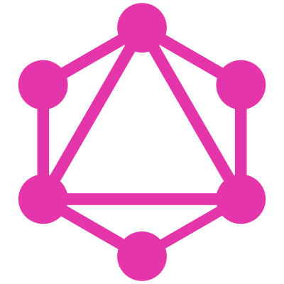

# GraphQL+

[Online](https://graphql-plus.github.io/)

Defining a successor to GraphQL 

To build the Specifications locally you can either:

1. Run the `build-local.ps1` script which requires the following to be installed:
   - A recent Dotnet SDK (8.0, 9.0 and 10.0 are tested)
   - The Node Version Selector tool (nvs) to be installed (as node 22 is currently required by docfx)

1. Run the customised docfx container built out of the included Dockerfile with:
   > run -v ".:/docs" docfx` using docker or podman
