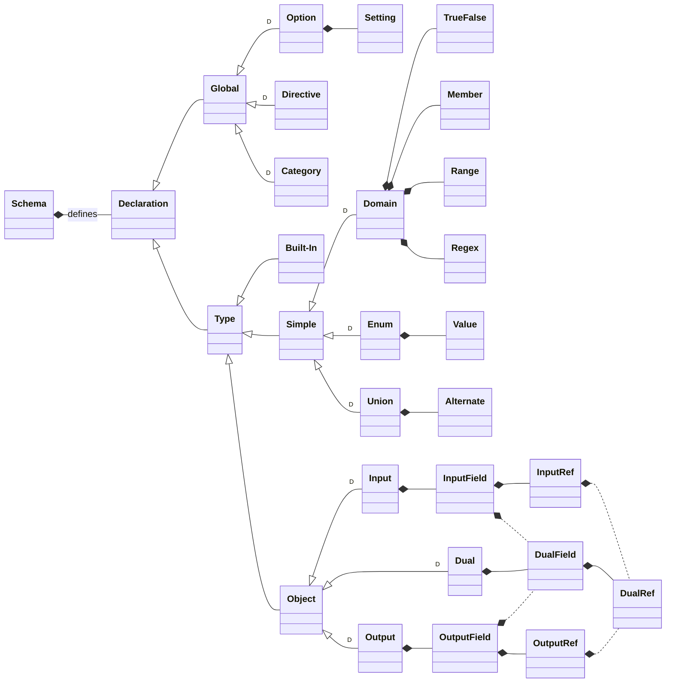
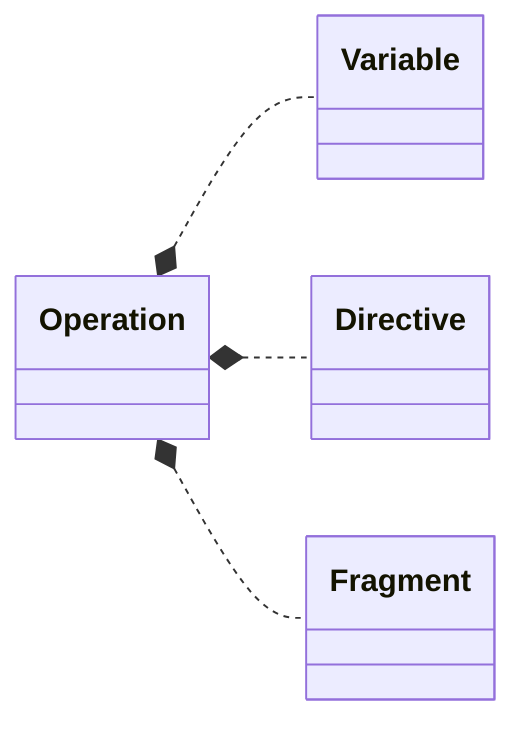

# Diagrams

## Schema

```mermaid
classDiagram
    direction LR
    Schema *-- Declaration : defines

    Declaration <|-- Global
    Declaration <|-- Type

    Global <|-- "D"Option
    Global <|-- "D"Directive
    Global <|-- "D"Category

    Option *-- Setting

    Type <|-- Built-In
    Type <|-- Simple
    Type <|-- Object

    Simple <|-- "D"Domain
    Simple <|-- "D"Enum
    Simple <|-- "D"Union

    Domain *-- TrueFalse
    Domain *-- Member
    Domain *-- Range
    Domain *-- Regex

    Enum *-- Value

    Union *-- Alternate

    Object <|-- "D"Input
    Object <|-- "D"Dual
    Object <|-- "D"Output

    Input *-- InputField
    InputField *-- InputRef
    InputField *.. DualField
    InputRef *.. DualRef

    Dual *-- DualField
    DualField *-- DualRef

    Output *-- OutputField
    OutputField *-- OutputRef
    OutputField *.. DualField
    OutputRef *.. DualRef
```

## Operation

```mermaid
classDiagram
  direction LR

  Operation *.. Variable
  Operation *.. Directive
  Operation *.. Fragment
```
