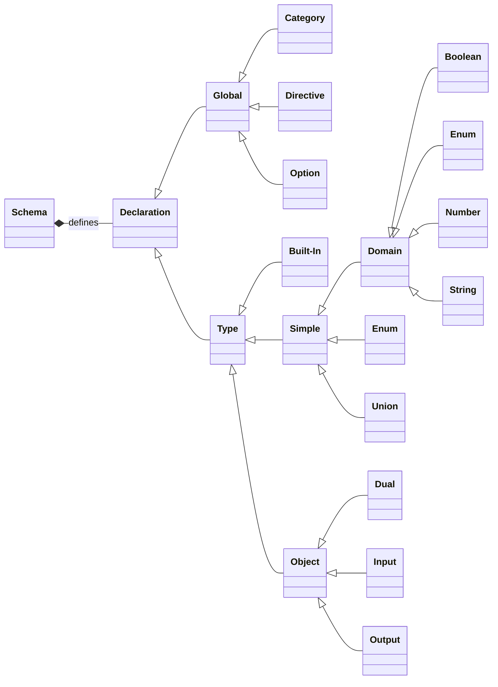

# Diagrams

## Schema

```mermaid
classDiagram
    direction LR
    Schema *-- Declaration : defines

    Declaration <|-- Global
    Declaration <|-- Type

    Global <|-- Category
    Global <|-- Directive
    Global <|-- Option

    Type <|-- Built-In
    Type <|-- Simple
    Type <|-- Object

    Simple <|-- Domain
    Simple <|-- Enum
    Simple <|-- Union

    Domain <|-- Boolean
    Domain <|-- D_Enum
    Domain <|-- Number
    Domain <|-- String
    class D_Enum["Enum"]

    Object <|-- Dual
    Object <|-- Input
    Object <|-- Output

```
