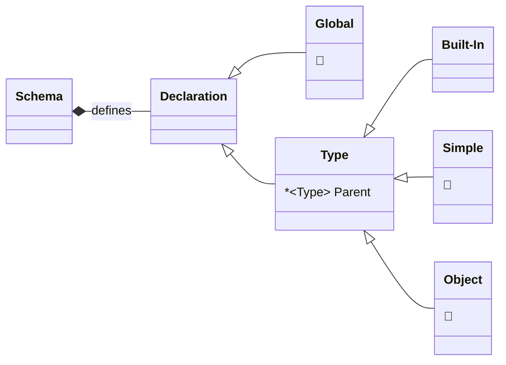
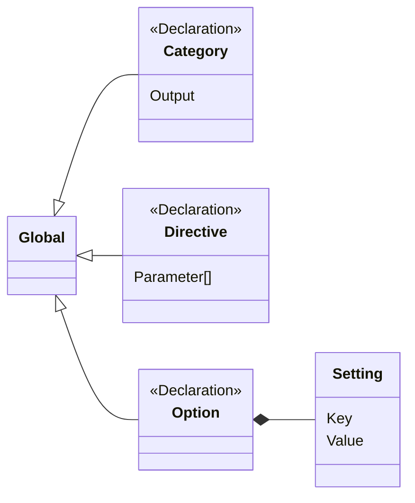
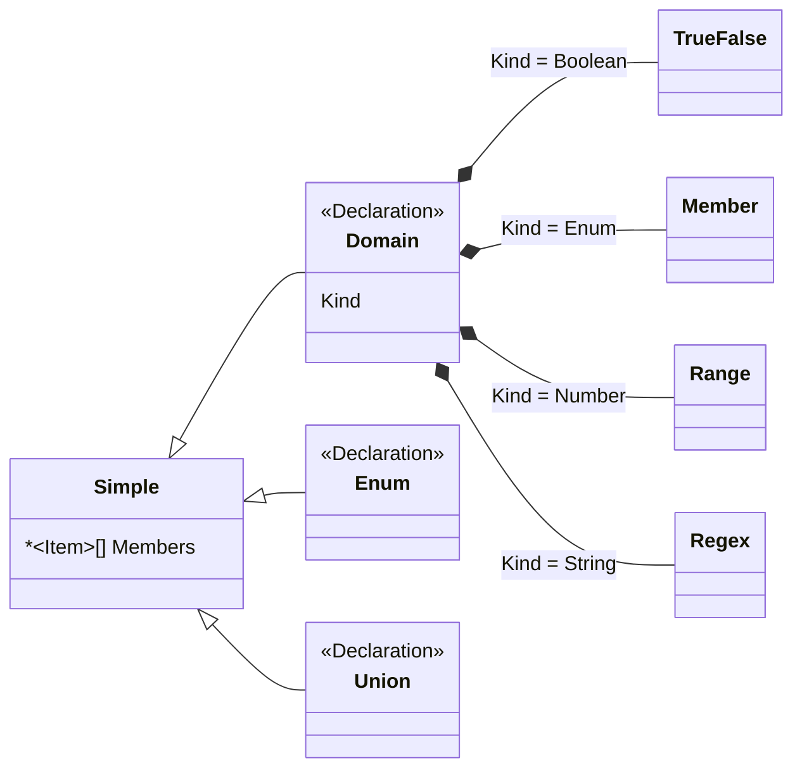
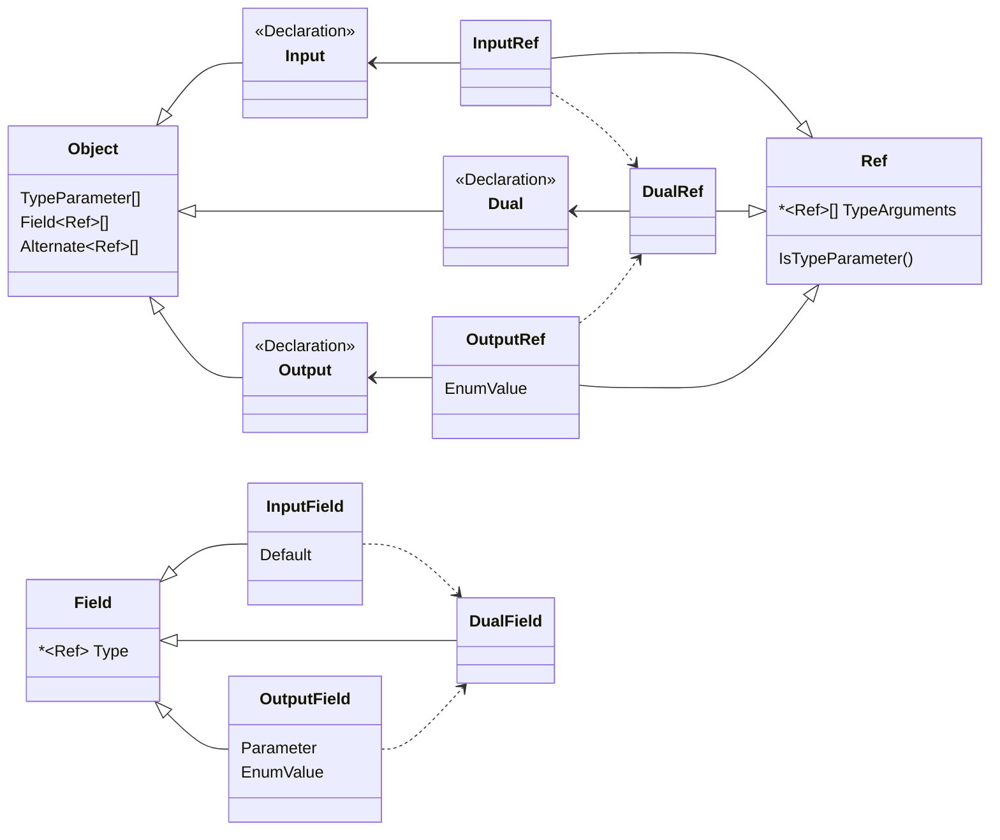
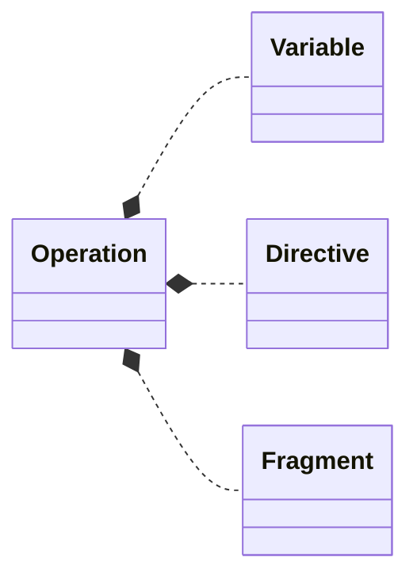

# Diagrams

## Schema

```mermaid
classDiagram
    direction LR

    Schema *-- Declaration : defines

    Declaration <|-- Global
    Declaration <|-- Type

    Type : *~Type~ Parent
    Type <|-- Built-In
    Type <|-- Simple
    Type <|-- Object

    Global : 🔗
    Simple : 🔗
    Object : 🔗

    link Global "#global-declarations"
    link Simple "#simple-types"
    link Object "#object-types"
```

### Global declarations

```mermaid
classDiagram
    direction LR

    Global <|-- Category
    Global <|-- Directive
    Global <|-- Option

    <<Declaration>> Category
    Category : Output

    <<Declaration>> Directive
    Directive : Parameter[]

    <<Declaration>> Option
    Option *-- Setting

    Setting : Key
    Setting : Value
```

### Simple types

```mermaid
classDiagram
    direction LR

    Simple  : *~Item~[] Members

    Simple <|-- Domain
    Simple <|-- Enum
    Simple <|-- Union

    <<Declaration>> Domain
    Domain : Kind

    Domain *-- TrueFalse : Kind = Boolean
    Domain *-- Member : Kind = Enum
    Domain *-- Range : Kind = Number
    Domain *-- Regex : Kind = String

    <<Declaration>> Enum
    <<Declaration>> Union
```

### Object types

```mermaid
classDiagram
    direction LR

    Object <|-- Input
    Object <|-- Dual
    Object <|-- Output

    Object : TypeParameter[]
    Object : Field~Ref~[]
    Object : Alternate~Ref~[]

    <<Declaration>> Input
    <<Declaration>> Dual
    <<Declaration>> Output

    InputRef ..> DualRef
    OutputRef : EnumValue

    Dual <-- DualRef
    Input <-- InputRef
    Output <-- OutputRef

    OutputRef ..> DualRef

    InputRef --|> Ref
    DualRef --|> Ref
    OutputRef --|> Ref

    Ref : *~Ref~[] TypeArguments
    Ref : IsTypeParameter()

    Field : *~Ref~ Type

    Field <|-- InputField
    Field <|-- OutputField

    InputField ..> DualField
    InputField : Default

    Field <|-- DualField

    OutputField ..> DualField
    OutputField : Parameter
    OutputField : EnumValue

```

## Operation

```mermaid
classDiagram
  direction LR

  Operation *.. Variable
  Operation *.. Directive
  Operation *.. Fragment
```
